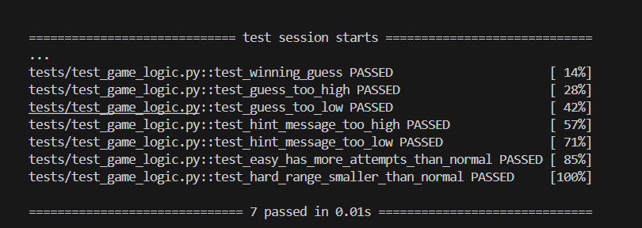

# 🎮 Game Glitch Investigator: The Impossible Guesser

## 🚨 The Situation

You asked an AI to build a simple "Number Guessing Game" using Streamlit.
It wrote the code, ran away, and now the game is unplayable. 

- You can't win.
- The hints lie to you.
- The secret number seems to have commitment issues.

## 🛠️ Setup

1. Install dependencies: `pip install -r requirements.txt`
2. Run the broken app: `python -m streamlit run app.py`

## 🕵️‍♂️ Your Mission

1. **Play the game.** Open the "Developer Debug Info" tab in the app to see the secret number. Try to win.
2. **Find the State Bug.** Why does the secret number change every time you click "Submit"? Ask ChatGPT: *"How do I keep a variable from resetting in Streamlit when I click a button?"*
3. **Fix the Logic.** The hints ("Higher/Lower") are wrong. Fix them.
4. **Refactor & Test.** - Move the logic into `logic_utils.py`.
   - Run `pytest` in your terminal.
   - Keep fixing until all tests pass!

## 📝 Document Your Experience

**Game purpose:**
A number guessing game built with Streamlit where the player tries to guess a secret number within a limited number of attempts. The difficulty setting controls the number range and how many attempts you get.

**Bugs found:**
1. **Hints were backwards** — "Too High" showed "Go HIGHER!" and "Too Low" showed "Go LOWER!", the exact opposite of what they should be.
2. **Attempt limits were wrong** — Easy had only 6 attempts while Normal had 8, meaning the easier mode was actually stricter.
3. **Hard range was easier than Normal** — Hard used 1–50 while Normal used 1–100, making Hard less challenging.
4. **Secret turned into a string on even attempts** — every second guess cast the secret to a string, breaking numeric comparison and causing random wrong hints.
5. **Difficulty change didn't reset the game** — switching difficulty kept the old secret and attempt count from the previous round.

**Fixes applied:**
- Swapped the hint messages in `check_guess` so "Too High" says "Go LOWER!" and "Too Low" says "Go HIGHER!"
- Reordered attempt limits to Easy: 10, Normal: 7, Hard: 5
- Refactored all game logic (`check_guess`, `parse_guess`, `get_range_for_difficulty`, `update_score`) from `app.py` into `logic_utils.py`
- Fixed existing pytest tests that were broken due to a tuple vs string mismatch, and added 4 new tests covering hint messages and difficulty ranges

## 📸 Demo

**All 7 pytest tests passing:**

## 🚀 Stretch Features

- [ ] [If you choose to complete Challenge 4, insert a screenshot of your Enhanced Game UI here]
